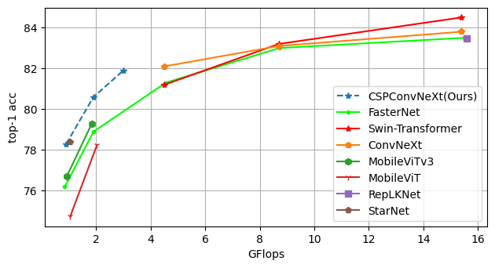

# E-ConvNeXt: A Lightweight and Efficient ConvNeXt Variant with Cross-Stage Partial Connections

> **Abstract:** from the outset, which has greatly restricted their scope of application. This paper takes ConvNeXt as
the research object and significantly reduces the parameter scale and network complexity of ConvNeXt
by integrating the Cross Stage Partial Connections mechanism and a series of optimized designs. The
new network is named E-ConvNeXt, which can maintain high accuracy performance under different
complexity configurations.The three core innovations of E-ConvNeXt are : (1) integrating the Cross
Stage Partial Network (CSPNet) with ConvNeXt and adjusting the network structure, which reduces
the model’s network complexity by up to 80%; (2) Optimizing the Stem and Block structures to
enhance the model’s feature expression capability and operational efficiency; (3) Replacing Layer
Scale with channel attention.Experimental validation on ImageNet classification demonstrates E-ConvNeXt’s superior accuracy-efficiency balance: E-ConvNeXt-mini reaches 78.3% Top-1 accuracy
at 0.9G FLOPs. E-ConvNeXt-small reaches 81.9% Top-1 accuracy at 3.1G FLOPs. Transfer learning
tests on object detection tasks further confirm its generalization capability.

  

# Classification results
### Image Classification for [ImageNet-1K](https://www.image-net.org)

| Model                    | FLOPs | #Params | Resolution | Top-1 |
|--------------------------|:-----:|:-------:|:----------:|:-----:|
| E-ConvNeXt-mini           | 0.9G  |  7.6M   | 224 x 224  | 78.3  |
| E-ConvNeXt-tiny           | 2.0G  |  13.2M   | 224 x 224  | 80.6  |
| E-ConvNeXt-small           | 3.1G  |  19.4M   | 224 x 224  | 81.9  |

# Downstream Results
## Object Detection for underwater sonar images
[underwater sonor dataset link](https://github.com/violetweir/Sonor_dataset)

### E-ConvNeXt as the backbone for PP-YOLOE and YOLOv10

| PP-YOLO-E with different Backbones | FLOPs | mAP |
|--------|:-----:|:-------:|
|PP-YOLOE-S| 17.4|42.6|
|PP-YOLO-S E-ConvNeXt-mini | 20.56 | 50.6 |
|PP-YOLOE-L | 110.7 | 49.0 |
|PP-YOLOE-L E-ConvNeXt-Tiny | 82.6 |  51.3 |

| YOLOv10 with different Backbones | FLOPs | mAP |
|--------|:-----:|:-------:|
| YOLOv10-L | 120 |46.1|
| YOLOv10-M ConvNeXt-tiny | 94.3 | 50.1 |
|PP-YOLOE-L | 110.7 | 49.0 |
| YOLOv10-M E-ConvNeXt-Tiny | 69.9 |  51.3 |

## Object Detection for underwater optical images(DUO dataset)
[Detecting Underwater Objects (DUO) link](https://github.com/chongweiliu/DUO)

| YOLOv10 with different Backbones | FLOPs | mAP |
|--------|:-----:|:-------:|
| YOLOv10-L | 120 |56.4|
| YOLOv10-L E-ConvNeXt-tiny | 78.0 | 61.2 |

If you want to train an E-ConvNeXt image classification model, please refer to [classification/README](classification/README.md)

If you want to use E-ConvNeXt as the backbone for object detection, please refer to [detection/README](detection/README.md)

# Acknowledgements

We are grateful, but not limited to, to the following knowledge bases and communities for their assistance in our research:

- [PaddleClas](https://github.com/PaddlePaddle/PaddleClas)

- [PaddleDetection](https://github.com/PaddlePaddle/PaddleDetection)

- [ConvNeXt](https://github.com/facebookresearch/ConvNeXt)

- [openi](https://openi.pcl.ac.cn/)

- [ai studio](https://aistudio.baidu.com/)

